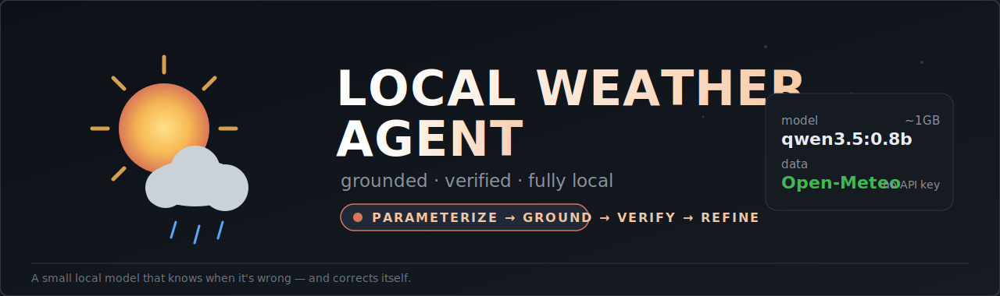
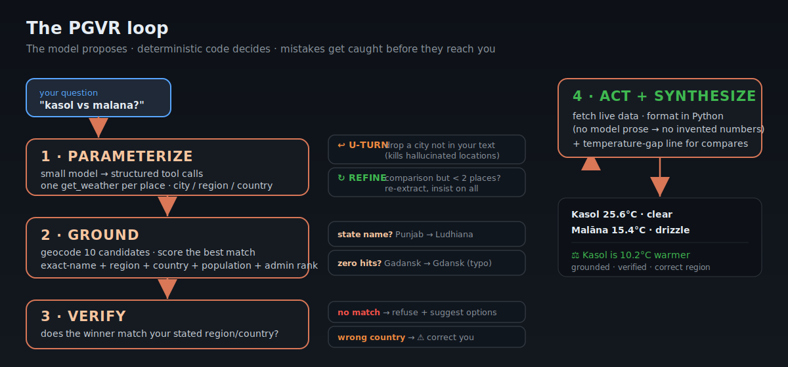
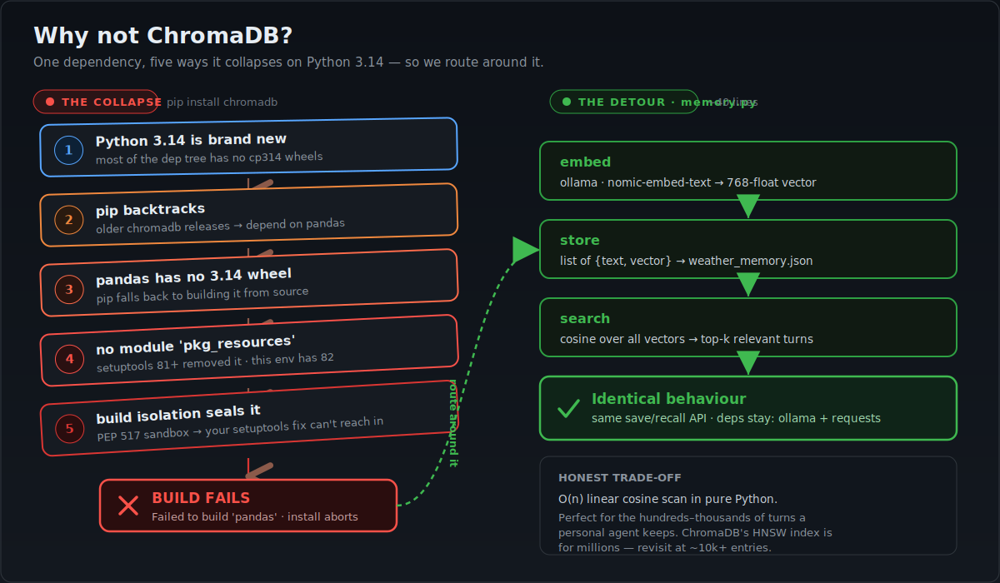

<p align="center">
  
</p>

<h1 align="center">🌤️ Local Weather Agent · PGVR</h1>

<p align="center">
  <b>A weather assistant that runs on a 1 GB local LLM — and knows when it's wrong.</b><br/>
  <sub>The small model proposes; deterministic code grounds, verifies, and corrects it before the answer reaches you.</sub>
</p>

<p align="center">
  
  
  
  
  
  
</p>

---

A natural-language weather assistant powered by a **small local LLM** (≈1 GB, CPU-only)
and **live, key-free weather data**. It began as a teaching notebook with a fake
`get_weather` dictionary and grew into a robust agent whose defining idea is a
**Parameterize → Ground → Verify → Refine (PGVR)** loop.

## Why this is different from a plain weather app

A 0.8B model is fast and free but unreliable: it fuzzy-resolves places, drops the
second city in a comparison, mis-parses "one week" as one day, and will happily report
a city the user never named. A geocoder is just as treacherous — "Kamand, Himachal
Pradesh" silently resolves to *Gamand, Iran*. This project treats those failures as
the **design problem** and solves each one with a deterministic guard.

| You type | A naive app does | This app does |
|---|---|---|
| `weather in Kamand, Himachal Pradesh` | Gamand, **Iran** 🇮🇷 | Kamānd, **Himachal Pradesh, India** ✓ |
| `weather in Punjab, India` | a random village "Punjābpura" | **Ludhiana, Punjab** (state → major city) ✓ |
| `weather in Gadansk, Ukraine` | "no such place" | typo-fixed → **Gdansk**, *⚠ in Poland, not Ukraine* ✓ |
| `kasol vs malana` | weather for Kasol only | **both**, plus "Kasol is 10.2°C warmer" ✓ |
| `forecast next one week` | 1 day | **7 days** ✓ |
| `HOW ARE YOU DIFFERENT?` | invents a city, reports its weather | **U-turns** — explains itself instead ✓ |

---

## The PGVR loop

<p align="center">
  
</p>

The final answer is formatted by **code, not the model** — deliberately. This 0.8B model
is a *thinking* model that runs away into an empty reasoning loop when asked to write
free-form prose, so we let it do what it's reliably good at (tool-calling with
schema-shaped arguments) and never let it invent numbers.

---

## Features

- 🧠 **Fully local** — `qwen3.5:0.8b` via [Ollama](https://ollama.com); no cloud, no key.
- 🌍 **Live weather** — current conditions + up to 7-day forecast via Open-Meteo.
- 🛡️ **Region-grounded resolution** — exact-name + importance scoring beats fuzzy matches.
- 🗺️ **Region gazetteer** — Indian states/UTs map to a representative city.
- ✎ **Typo tolerance** — edit-distance-1 fallback (`Gadansk` → `Gdansk`).
- ⚠ **Wrong-country correction** — tells you when a place isn't where you said.
- ↩ **U-turn guard** — refuses to fabricate a location for non-weather questions.
- ⚖️ **Multi-city compare** — fetches every place and states the temperature gap.
- 🗣️ **Deterministic intent** — current-vs-forecast and day-count read from *your words*.
- 💾 **Vector memory** *(ReAct app)* — remembers your home city across restarts.
- 🎨 **Polished CLI** — colored welcome banner and feature panel.

---

## Quick start

```bash
# 1. Ollama (https://ollama.com) running, with the models:
ollama pull qwen3.5:0.8b        # chat model  (~1 GB)
ollama pull nomic-embed-text    # embeddings for the memory feature

# 2. Python deps:
pip install -r requirements.txt # ollama + requests

# 3. Run the smart agent:
python3 weather_app.py --smart                       # banner + interactive
python3 weather_app.py --smart "weather in Tokyo"    # one-shot
python3 agentic.py "is it warmer in Mumbai or Delhi?" # same engine, direct
```

> Uses `python3`. To use a different model, edit `MODEL` in `weather_app.py`.

---

## Two apps, one engine

| File | What it is |
|---|---|
| [`agentic.py`](agentic.py) | **The PGVR smart agent** — all the grounding/verification logic above. |
| [`weather_app.py`](weather_app.py) | The original **ReAct** agent (tool loop) + a **lightweight ChromaDB-style vector memory** (no `chromadb` dependency — see below); `--smart` routes into `agentic.py`. |
| [`memory.py`](memory.py) | Persistent vector memory (Ollama embeddings + cosine search + JSON store). |
| [`Agentic_AI_Day6.ipynb`](Agentic_AI_Day6.ipynb) | The teaching notebook this project grew out of. |

### Modes

```bash
python3 weather_app.py            # ReAct agent + memory ("my home city is Pune" → remembered)
python3 weather_app.py --smart    # PGVR agent (recommended)
```

---

## Example session

```
you ▸ what's the weather in kasol and how is it different from malana
▸ 'Kasol'  (region='Himachal Pradesh', country='India', mode=current)
  geocode('Kasol') → 10 candidates
  ✓ matched ['name✓', 'region✓', 'country✓'] → Kasol, Himachal Pradesh, India
▸ 'Malana' (region='Himachal Pradesh', country='India', mode=current)
  ✓ matched ['name✓', 'country✓'] → Malāna, Himachal Pradesh, India

Kasol, Himachal Pradesh, India
Now: 25.6°C (feels like 25.9°C), clear sky, humidity 44%, wind 3.3 km/h

Malāna, Himachal Pradesh, India
Now: 15.4°C (feels like 14.9°C), light drizzle, humidity 66%, wind 2.4 km/h

Difference: Kasol is 10.2°C warmer than Malāna (25.6°C vs 15.4°C).
```

The `▸`/`✓`/`↩`/`✎`/`⚠` lines are the loop's live trace — you can watch it ground and
verify each place.

---

## Design notes

- **Small-model discoveries.** `qwen3.5:0.8b` returns *empty* content under
  JSON-schema-constrained decoding (its thinking trace eats the budget), but is a
  reliable **tool-caller**. So parameterization is done via tool-calling, and synthesis
  is done in Python.
- **The model proposes, code decides.** Mode, day-count, location grounding, comparison
  math, and hallucination filtering are all deterministic overrides of the model's
  guesses — that's what makes a 0.8B model trustworthy here.
- **Honesty over guessing.** When a place can't be grounded to the stated region, the
  app says so and offers candidates rather than reporting the wrong city.

---

## Why not ChromaDB? (the memory layer)

The teaching notebook used **ChromaDB** for conversation memory. On **Python 3.14**,
`pip install chromadb` collapses through five toolchain dominoes — so we route around it
with ~40 lines that reproduce exactly the slice we use:

<p align="center">
  
</p>

In words: Python 3.14 has no `cp314` wheels for much of the tree → pip backtracks to older
chromadb releases that need **pandas** → that pandas has no 3.14 wheel and builds from
source → the build hits `ModuleNotFoundError: pkg_resources` (**setuptools 81+ removed it**;
this env has 82) → **PEP 517 build isolation** means fixing setuptools in your main env
never reaches the sandbox. New Python × old pandas × new setuptools, locked in.

The replacement maps onto ChromaDB one-to-one:

| ChromaDB / LangChain piece | Our equivalent ([`memory.py`](memory.py)) |
|---|---|
| `OllamaEmbeddings` / embedding function | `ollama.embed("nomic-embed-text")` → 768-float vector |
| `Chroma(persist_directory=…)` SQLite+parquet store | a `list[{text, embedding}]` dumped to `weather_memory.json` |
| `similarity_search` (HNSW index) | `_cosine()` over all vectors → sort → top-`k=3` above `min_score` |
| `VectorStoreRetrieverMemory.save_context()` / `load_memory_variables()` | `save_context()` / `recall()` — same names, same flow |

---

## License

MIT — see [LICENSE](LICENSE).
